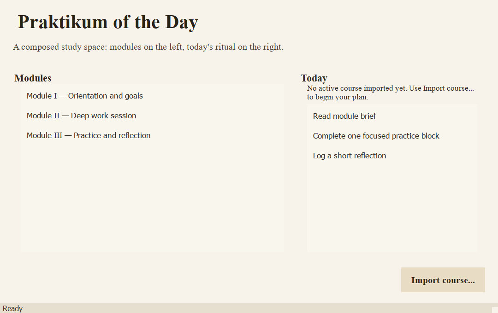

# PR#2 - UI Theme and Shell

## What
- Refined the UI theme in `src/praktikum_app/assets/theme/app.qss` to use EB Garamond across text.
- Removed block outlines and simplified surfaces for stronger minimalism.
- Increased typography scale for headers, lists, actions and status text.

## Why
- Addressed blocking review feedback before merge.
- Aligned visual direction with a calmer, more readable renaissance-minimal shell.

## How
- Updated QSS tokens for typography, spacing and states without changing business logic.
- Kept architecture boundaries intact (`presentation/qt` only for this revision).

## Screens

## Risks / Edge Cases
- If EB Garamond is not available at runtime, Qt falls back to an available font.
- Visual tone in headless CI may differ slightly from desktop rendering.

## Checklist
- [x] Ruff green
- [x] Pyright strict green
- [x] Pytest green
- [x] Tray behavior verified on Windows
